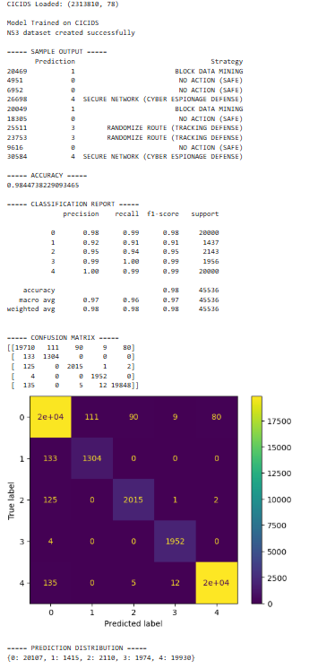

# 🚀 IoT Intrusion Detection System using Machine Learning & Game Theory


---

## 📌 Overview

This project implements an **Intrusion Detection and Prevention System (IDPS)** for IoT networks using **Machine Learning and Game Theory**.

The system detects multiple types of cyber attacks from network traffic and applies **optimal defense strategies** based on a game-theoretic approach.

---

## 🚀 Features

* Multi-class attack detection
* Random Forest classifier
* Game-theoretic defense mechanism
* High accuracy (~98%)
* Real-world dataset (CICIDS)
* NS3-based test data simulation

---

## 🔄 System Workflow

CICIDS Dataset
↓
Data Preprocessing
↓
Feature Extraction
↓
Random Forest Model Training
↓
NS3 Test Data Generation
↓
Attack Detection
↓
Game Theory Strategy Selection

---

## 🧠 Attack Types

* Normal Traffic
* Data Mining
* Eavesdropping
* Tracking
* Cyber Espionage

---

## ⚙️ Methodology

1. Data collected from CICIDS2017 dataset
2. Preprocessing and feature selection
3. Multi-class classification using Random Forest
4. NS3-based dataset generation for testing
5. Attack prediction using trained model
6. Strategy selection using game theory

---

## 📊 Results

* Accuracy: **~98%**
* Strong confusion matrix performance
* Balanced classification across all attack types

---

## 🖼️ Output



---

## ▶️ How to Run

1. Clone the repository:

   ```bash
   git clone https://github.com/yourusername/iot-intrusion-detection.git
   ```

2. Install dependencies:

   ```bash
   pip install pandas numpy scikit-learn matplotlib
   ```

3. Open the notebook:

   ```bash
   jupyter notebook
   ```

4. Run all cells step-by-step

---

## 📁 Dataset

Dataset used: **CICIDS2017**

Due to large size, it is not included in this repository.

Download from:
https://www.unb.ca/cic/datasets/ids-2017.html

---

## 🛠️ Technologies Used

* Python
* Pandas
* NumPy
* Scikit-learn
* Matplotlib
* Jupyter Notebook

---

## 📌 Conclusion

The system successfully detects multiple types of cyber attacks and applies **optimal defense strategies** using a game-theoretic approach, making it suitable for **real-world IoT security applications**.

---

## 👨‍💻 Author

Raghavendra Boinapelly
